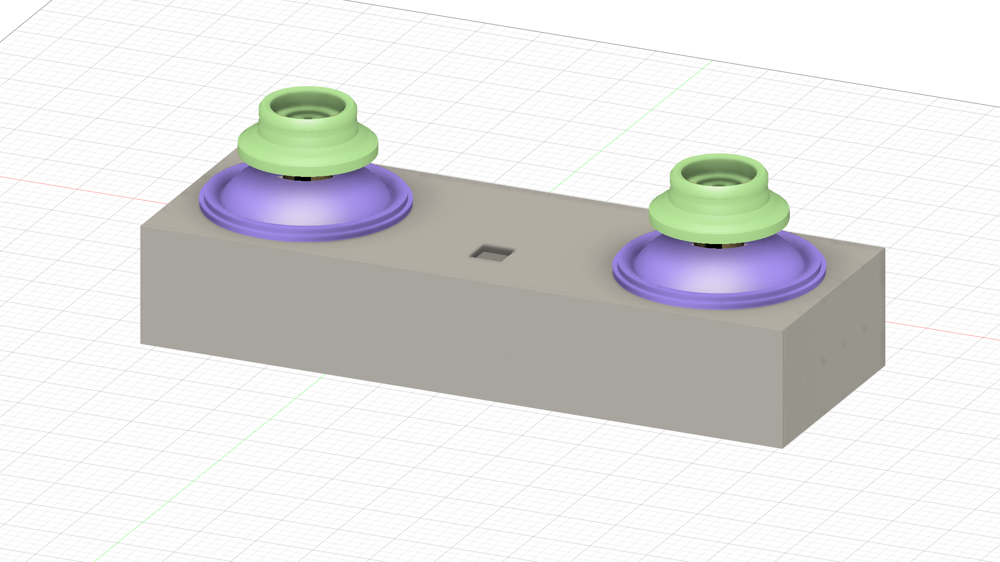
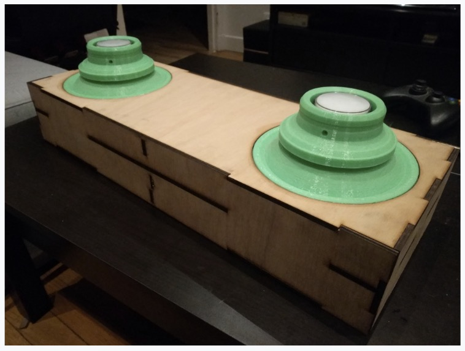

# Groove Coaster Controller 2023 (Modified by Anthony Raudino)
This is a fork of the fork of the original project modified with some adjustments as well as acrylic cuts, custom prints as well as a custom PCB!

# This is a WIP as I refine things. Don't use the stick tubes from the CAD, they didn't convert well.

* Original readme included in seperate file for anyone wanting to follow the original Teensy instructions, though I don't suggest it.

# Groove Coaster Controller
GrooveCoaster Controller replica with dimensions from real cabinet  
Box is 20 x 10 x 56.5 cm

# needed
- Microcontroller with an RP2040 (PCB is for sparkfun promicro 2040)
- a 3D printer
- a laser cutting machine
- 5mm plywood OR acrylic 
- 2 x seimitsu LS32-SE joysticks
- 2 x 60mm buttons
- A lot of screws, specific amount coming soon
- M3 heat set inserts, I suggest the CNC Kitchen since that's what I designed for.

# things to 3d print
- 2 x joy_stick.stl
- 2 x joy_base.stl
- 2 x joy_tube.stl
- All the corner brackets. This will help in rigidity and assembly

# things to laser cut
- 2 x box_side.dxf
- 2 x box_insert.dxf (goes on box_middle, helps for rigidity)
- 1 x box_front.dxf
- 1 x box_back.dxf
- 1 x box_top.dxf
- 1 x box_middle.dxf
- 1 x box_bottom.dxf

# assembly
### COMING SOON

# soldering (If you're not using the PCB)
- Use schematic tbh.
